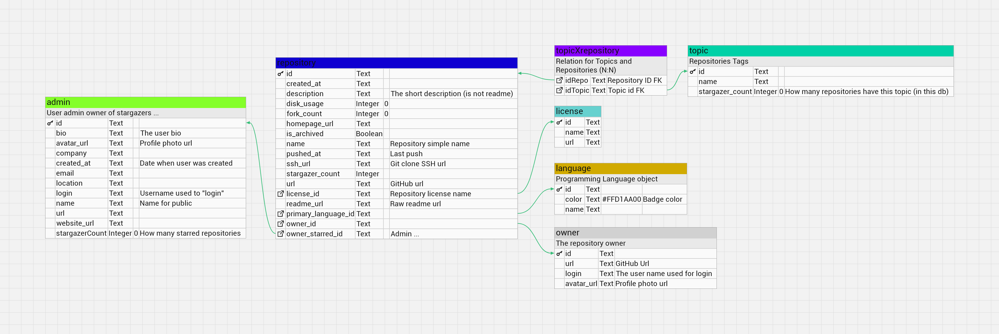

# Stargazers Actions With Postgres 

> [!NOTE]
> You can use this template: [sawp-template](https://github.com/tutosrive/sawp-template)

> [!WARNING]
> I don't filter private repositories in this version ([v0.2.0](https://github.com/tutosrive/sawp/releases/tag/v0.2.0)), use it with precaution ...

> [!IMPORTANT]
> You can use any postgres server provider, like supabase, azure, any but one that support connection string IPV4 (This repo don't support IPV6 right now)

## Requirements:

1. Just get your postgres "Connection String" (postgres format: `postgresql://postgres...`)
2. Github Token (Repo Scope and User Scope for read repositories data and user data as ADMIN)
3. Github User Name

# How use?

You can use this action using a action file (`.yml` or `.yaml`) like this:

```yaml
name: SAWP

on:
    workflow_dispatch:

jobs:
    build:
        runs-on: ubuntu-latest

        steps:
            # Checks-out your repository under $GITHUB_WORKSPACE, so your job can access it
            - uses: actions/checkout@v7

            # Process all Starred Repositoties from an User
            - name: SWP-action
              uses: tutosrive/sawp@v0.2.0.release
              with:
                  github-user: ${{ github.actor }} # Or any GitHub Username
                  github-token: ${{ secrets.GITHUB_TOKEN }}
                  db-connection-url: ${{ secrets.DB_CONN_URL }} # Supabase connection string "postgresql://postgres..."
```

---

### Database Model (v0.2.0.release)



---

(I use Supabase, and there is it status)
### Still Alive Supabase

My Stargazer supabase is alive?: [](https://zxl40pkp.status.cron-job.org/)
